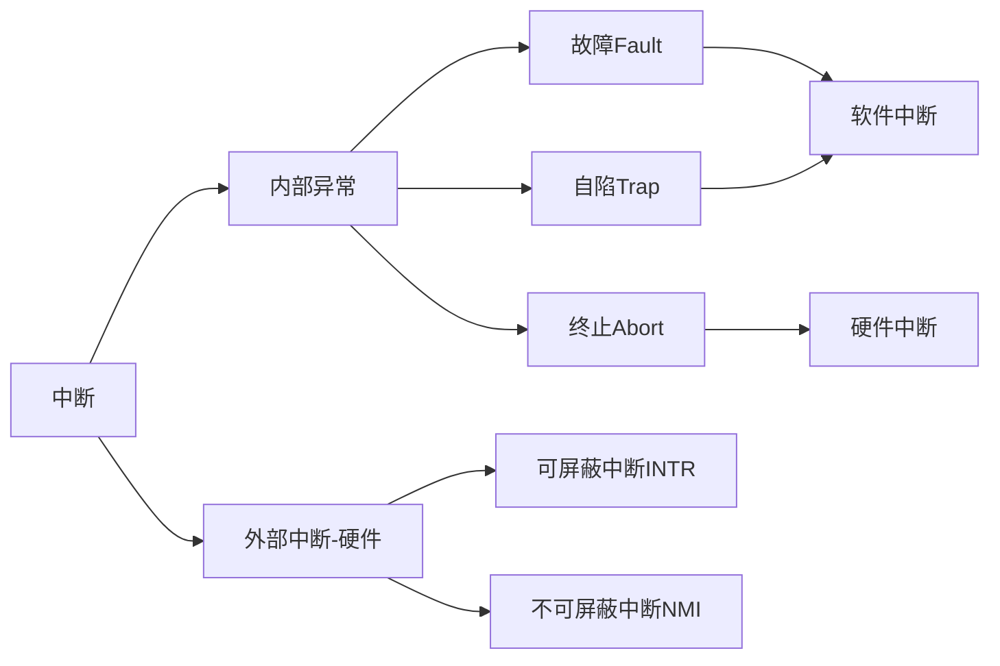
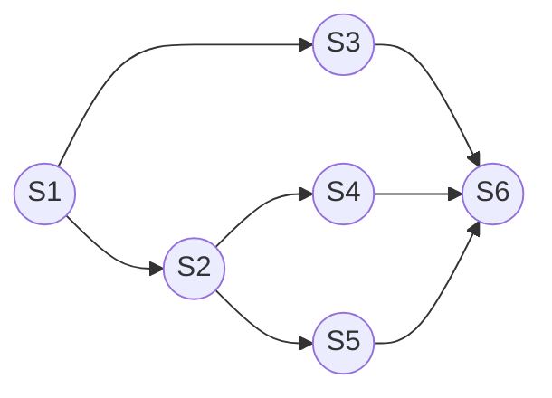
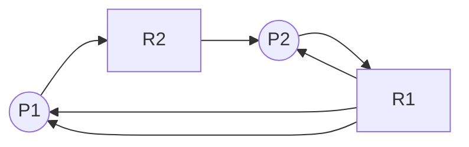
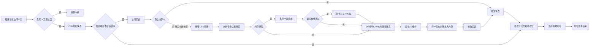
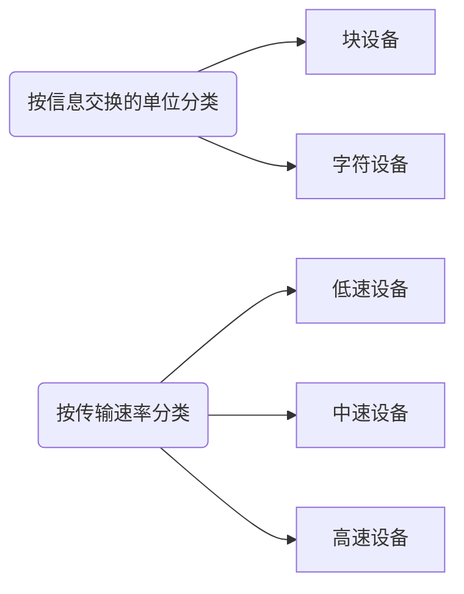

# 第1章 计算机系统概述

> ### 考纲内容
>
> 1. 操作系统的基本概念
>
> 2. 操作系统的发展历程
>
> 3. 程序运行环境
>
>    CPU运行模式：内核模式和用户模式
>
>    中断和异常的处理；系统调用
>
>    程序的链接与装入；程序运行时内存映像与地址空间
>
> 4. 操作系统结构：分层、模块化、宏内核、微内核、外核
>
> 5. 操作系统引导
>
> 6. 虚拟机
>
> ### 复习提示
>
> 本章通常以选择题的形式考查，重点考查操作系统的功能、运行环境和提供的服务

## 1.1 操作系统的基本概念

### 1.1.1 操作系统的概念

硬件提供基本的计算资源；应用程序规定按何种方式使用这些资源来解决用户的计算问题；操作系统控制和协调各用户的应用程序对硬件的分配和使用。

> 操作系统（Operating System，OS）是指控制和管理整个计算机系统的硬件和软件资源，合理地组织、调度计算机的工作与资源的分配，进而为用户和其它软件提供方便接口与环境的**`程序集合`**。
>
> 操作系统是计算机系统中**`最基本的系统软件`**。

### 1.1.2 操作系统的特征

#### 1. 并发 Concurrence

并发是指两个或多个事件在<font style="color: mediumaquamarine">同一时间间隔内</font>发生。操作系统的并发性指的是计算机系统中同时存在多个运行的程序，它是通过分时来实现的。

> <font style="color: mediumaquamarine; font-weight: bold">并行性</font>指的是系统具有同时进行运算或操作的特性，在<font style="color: mediumaquamarine">同一时刻</font>能完成两种或两种以上的工作。

#### 2. 共享 Sharing

指系统中的资源可供内存中多个并发执行的进程同时使用，它分为一下两种资源共享方式：

- 互斥共享方式
- 同时访问方式

> 在一段时间内只允许一个进程访问的资源称为<font style="color: #409EFF; font-weight: bold">临界资源</font>或<font style="color: #409EFF; font-weight: bold">独占资源</font>。

<font style="font-weight: bold; color: red; font-size: 20px">并发</font>和<font style="font-weight: bold; color: red; font-size: 20px">共享</font>是OS两个最基本的特征，两者之间互为存在条件：

① 资源共享是以程序并发为条件的；如果系统不允许程序并发执行，则自然不存在资源共享问题。

② 如果系统不能对资源共享实施有效的管理，则必将影响到程序的并发执行，甚至根本无法并发执行。

#### 3. 虚拟 Virtual

操作系统利用了多种虚拟技术来实现虚拟处理器、虚拟内存和虚拟外部设备等。操作系统的虚拟技术可归纳为：<font style="color: mediumaquamarine">时分复用技术</font>和<font style="color: mediumaquamarine">空分复用技术</font>。

#### 3. 异步 Asynchronism

多道程序环境允许多个程序并发执行，而由于资源有限，使得进程的执行并不是一贯到底的，它以不可预知的速度前行，这就是进程的异步性。

异步性使得OS运行在一种随机的环境下，可能导致进程产生和时间相关的错误。但是，只要运行环境相同，OS就必须保证多次运行进程后都能获得相同结果。

### 1.1.3 操作系统的目标和功能

#### 1. 操作系统作为计算机系统资源的管理者

- <font style="color: mediumaquamarine; font-weight: bold">进程管理</font>：进程控制、进程同步、进程通信、死锁处理、处理机调度等
- <font style="color: mediumaquamarine; font-weight: bold">存储器管理</font>：内存分配与回收、地址映射、内存保护与共享和内存扩充等功能
- <font style="color: mediumaquamarine; font-weight: bold">文件管理</font>：文件存储空间的管理、目录管理及文件读写管理和保护等
- <font style="color: mediumaquamarine; font-weight: bold">设备管理</font>：缓冲管理、设备分配、设备处理和虚拟设备等功能

#### 2. 操作系统作为用户与计算机硬件系统之间的接口

OS为用户提供的接口主要分为两类：一类是命令接口，用户利用这些操作命令来组织和控制作业的执行；另一类是程序接口，编程人员可以使用它们来请求操作系统服务。

##### a> <font style="color: mediumaquamarine; font-weight: bold">命令接口</font>

使用命令接口进行作业控制的主要方式有两种：即联机控制方式和脱机控制方式。

联机命令接口又称为交互式命令接口，“说一句，做一句”，这就强调了交互性。

脱机命令接口又称为批处理命令接口，“说一堆，做一堆”。

##### b> <font style="color: mediumaquamarine; font-weight: bold">程序接口</font>

程序接口由一组系统调用（也称广义指令）组成。

#### 3. 操作系统作为扩充机器

## 1.2 操作系统的发展与分类

### 1.2.1 手工操作阶段（无OS）

① <font style="color: #409EFF; ">用户独占全机，资源利用率低</font>

② <font style="color: #409EFF; ">CPU等待手工操作，利用不充分</font>

### 1.2.2 批处理阶段（OS开始出现）

#### 1. 单道批处理系统

主要特征：

- <font style="color: #409EFF; font-weight: bold">自动性</font>
- <font style="color: #409EFF; font-weight: bold">顺序性</font>
- <font style="color: #409EFF; font-weight: bold">单道性</font>

<font style="color: #409EFF; ">高速的CPU经常处于等待低速的I/O完成的状态</font>

#### 2. 多道批处理系统

特点：

- <font style="color: #409EFF; font-weight: bold">多道</font>
- <font style="color: #409EFF; font-weight: bold">宏观上并行</font>
- <font style="color: #409EFF; font-weight: bold">微观上串行</font>

它的实现需要解决一下问题：

1. 如何分配处理器
2. 多道程序的内存分配问题
3. I/O设备如何分配
4. 如何组织和存放大量的程序和数据，以方便用户使用和保证其安全性与一致性

<font style="color: mediumaquamarine; font-weight: bold">优点</font>：资源利用率高、系统吞吐量大

<font style="color: mediumaquamarine; font-weight: bold">缺点</font>：用户响应的时间较长；不提供人机交互能力，用户既不能了解自己的程序的运行情况，又不能控制计算机

### 1.2.3 分时操作系统

主要特征：

- <font style="color: #409EFF; font-weight: bold">同时性</font>：允许多个终端用户同时使用一台计算机
- <font style="color: #409EFF; font-weight: bold">交互性</font>
- <font style="color: #409EFF; font-weight: bold">独立性</font>：多个用户彼此独立地进行操作
- <font style="color: #409EFF; font-weight: bold">及时性</font>：用户在短时间内就能得到响应

分时系统很好的解决了人机交互的问题，但在一些实时应用场景中表现一般。

### 1.2.4 实时操作系统

实时操作系统的主要特点是<font style="color: #409EFF; font-weight: bold">及时性</font>和<font style="color: #409EFF; font-weight: bold">可靠性</font>

### 1.2.5 网络操作系统和分布式操作系统

### 1.2.6 个人计算机操作系统

## 1.3 操作系统的运行环境

### 1.3.1 操作系统的运行机制

CPU的状态划分为<font style="color: #409EFF; ">用户态</font>（目态）和<font style="color: #409EFF; ">核心态</font>（管态、内核态）；用户自编的程序运行在用户态，操作系统内核程序运行在核心态。大多数操作系统的内核包括以下四个方面的内容：

#### 1. 时钟管理

#### 2. 中断机制

中断机制中，只有一小部分功能属于内核，它们负责保护和恢复中断现场的信息，转移控制权到相关的处理程序。

#### 3. 原语

- 处于操作系统最底层，是最接近硬件的部分
- 这些程序的运行具有原子性，其操作只能一气呵成
- 这些程序的运行时间都比较短，而且调用频繁

#### 4. 系统控制的数据结构及处理

### 1.3.2 中断和异常的概念

为了实现可以在用户态和核心态两种工作状态之间切换，引入了中断和异常。当发生中断或异常时，运行用户态的CPU会立即进入核心态（通过硬件实现的）。

#### 1. 中断和异常的定义

中断也称外中断，是指来自CPU执行指令外部的事件。异常也称内中断，是指来自CPU执行指令内部的事件

#### 2. 中断和异常的分类



#### 3. 中断和异常的处理过程

### 1.3.3 系统调用

按功能分：

- 设备管理
- 文件管理
- 进程控制
- 进程通信
- 内存管理

## 1.4  系统结构

### 1. 分层法

分层法优点：

- 便于系统的调试和验证，简化了系统的设计和实现
- 易扩充和维护

问题：

- 合理定义各层比较困难，因为依赖关系固定后，往往就显得不够灵活
- 效率较差，操作系统每执行一个功能，通常要自上往下穿越多层

### 2. 模块化

按功能划分为若干具有一定独立性的模块，每个模块具有某方面的管理功能，并规定好各模块间的接口，使各模块之间能够通过接口进行通信。

衡量模块的独立性主要两个标准：内聚性和耦合度

模块化优点：

- 提高了操作系统设计的正确性、可理解性和可维护性
- 增强了操作系统的可适应性
- 加速了操作系统的开发过程

缺点：

- 模块间的接口规定很难满足对接口的实际需求
- 各模块设计者齐头并进，每个决定无法建立在上一个已验证的正确决定的基础上，因此无法找到一个可靠的决定顺序

### 3. 宏内核

将系统的主要功能模块都作为一个紧密联系的整体运行在核心态，从而为用户程序提供高性能的系统服务。因为各管理模块直接共享信息，能有效利用相互之间的有效特性，所以具有无可比拟的性能优势

### 4. 微内核

将内核中最基本的功能保留在内核，而将那些不需要在核心态执行的功能移动到用户态执行，从而降低内核的实际复杂性。那些移出内核的操作系统代码根据分层的原则被划分成若干服务程序，它们的执行相互独立，交互则都借助于微内核进行通信。

#### a> 微内核的基本功能

- 进程管理
- 低级存储器管理
- 中断和陷入处理

#### b> 微内核的特点

- 扩展性和灵活性
- 可靠性和安全性
- 可移植性
- 分布式计算

主要问题是性能问题

### 5. 外核

## 1.5 操作系统引导

常见操作系统引导过程如下：

1. 激活CPU
2. 硬件自检
3. 加载带有操作系统的硬盘
4. 加载主引导记录MBR
5. 扫描硬盘分区表
6. 加载分区引导记录PBR
7. 加载启动管理器
8. 加载操作系统

## 1.6 虚拟机

> #### 本章疑难点：
>
> 1. 并行性和并发性的区别与联系
> 2. 特权指令和非特权指令
> 3. 访管指令和访管中断
> 4. 定义微内核结构OS的四个方面

# 第2章 进程管理

> ### 考纲内容：
>
> - 进程与线程
>   - 进程与线程的基本概念；进程/线程的状态与切换
>   - 线程的实现：内核支持的线程，线程库支持的线程
>   - 进程与线程的组织与控制
>   - 进程间的通信：共享内存，消息传递，管道
> - CPU调度与上下文切换
>   - 调度的基本概念；调度的目标
>   - 调度的实现：调度器/调度程序（scheduler），调度的时机与调度方式（抢占式/非抢占式），闲逛进程，内核级线程与用户级线程调度
>   - 典型调度算法：先来先服务、短作业优先、时间片轮转、优先级、高响应比、多级队列、多级反馈队列
>   - 上下文及其切换机制
> - 同步与互斥
>   - 同步与互斥的基本概念
>   - 基本的实现方法：软件方法；硬件方法
>   - 锁；信号量；条件变量
>   - 经典同步问题：生产者-消费者问题，读者-写者问题；哲学家进餐问题
> - 死锁
>   - 死锁的基本概念；死锁预防
>   - 死锁避免；死锁检测和解除

## 2.1 进程与线程

### 2.1.1 进程的概念和特征

#### 1. 进程的概念

为了更好的描述和控制程序的并发执行，引入了进程的概念，从而实现了操作系统的并发性和共享性。

为了使参与并发执行的程序能够独立的运行，系统利用一个专门的数据结构——进程控制块（Process Control Block,PCB）来描述进程的基本情况和运行状态，进而控制和管理进程。

进程映像（进程实体）由三部分组成：

- 程序段
- 相关数据段
- PCB

所谓创建进程，其实就是创建进程映像中的PCB，同理，撤销进程则是撤销进程的PCB。

> 进程映像是静态的，进程是动态的
>
> **PCB是进程存在的唯一标志！**

*进程是进程实体的运行过程，是系统进行资源分配和调度的一个基本单位*

#### 2. 进程的特征

##### a> 动态性——最基本特征

##### b> 并发性——引入进程的目的

##### c> 独立性——基本单位，凡是未建立PCB的程序，都不能作为一个独立单位参与运行

##### d> 异步性——导致结果的不可在现性，从而出现进程同步机制

##### e> 结构性——进程实体由三部分组成

### 2.1.2 进程的状态与切换

三种基本状态：运行态、就绪态、阻塞态，以及创建态和结束态。

就绪态是指除了处理机资源，其他资源都已经到位了，而等待态则表示着还需要其他资源（除了处理机）或等待某一事件。

一个进程从运行态到阻塞态是主动的行为；但是从阻塞态变成就绪态是被动的行为，需要其他进程协助。

### 2.1.3 进程控制

#### 1. 进程的创建

进程创建原语：

- 分配唯一进程标识号，申请一个空白PCB（申请失败，则创建失败）
- 为进程分配资源（资源不足，处于阻塞态）
- 初始化PCB（主要包括标识信息、处理机状态、处理机控制信息，以及设置进程的优先级等）
- 就绪队列有空闲，则将其插入就绪队列，等待被调度

#### 2. 进程的终止

进程撤销原语：

- 根据被终止进程的标识符，检索PCB，从中读出该进程的状态
- 若其处于执行状态，立即终止，将处理机资源分配给其他进程
- 若有子孙进程，应将其也全部终止
- 将其拥有的所有资源，归还给父进程或者OS
- 将该PCB从所在队列中删除

#### 3. 进程的阻塞和唤醒

进程阻塞原语：

- 根据标识号找到对应的PCB
- 若处于运行态，保护现场，转为阻塞态，并停止运行
- 把该PCB插入等待队列，将处理机资源调度给其他就绪进程

唤醒原语：

- 从等待队列中找到对应PCB
- 将其从等待队列移出，置为就绪态
- 把该PCB插入就绪队列，等待调度程序调度

#### 4. 进程切换

指的是：处理机从一个进程的运行转到另一个进程上运行，过程如下：

- 保存处理机上下文，包括程序计数器和其他寄存器

- 更新PCB信息
- 把进程的PCB移入相应队列
- 选择另一个进程执行，并更新其PCB
- 更新内存管理的数据结构
- 恢复处理机上下文

> **调度**和**切换**：调度是一种决策行为，为切换是实际分配的行为，是执行行为。一般先有资源的调度，然后才有进程的切换。

### 2.1.4 进程的组织

#### 1. 进程控制块

| 进程描述信息      | 进程控制和管理信息 | 资源分配清单 | 处理机相关信息 |
| ----------------- | ------------------ | ------------ | -------------- |
| 进程标识符（PID） | 进程当前状态       | 代码段指针   | 通用寄存器值   |
| 用户标识符（UID） | 进程优先级         | 数据段指针   | 地址寄存器值   |
|                   | 代码运行入口地址   | 堆栈段指针   | 控制寄存器值   |
|                   | 程序的外存地址     | 文件描述符   | 标志寄存器值   |
|                   | 进入内存时间       | 键盘         | 状态字         |
|                   | 处理机占用时间     | 鼠标         |                |
|                   | 信号量使用         |              |                |

> 常用的PCB组织方式有链接和索引两种

#### 2. 程序段

执行的程序代码段，程序可被多个进程共享，即多个进程可以运行同一个程序

#### 3. 数据段

原始数据，执行过程的中间或最终结果

### 2.1.5 进程的通信

#### 1. 共享存储

#### 2. 消息传递

#### 3. 管道通信

### 2.1.6 线程概念和多线程模型

#### 1. 线程的基本概念

引入线程的目的是减小程序在并发执行时所付出的时空开销，提高操作系统的并发性能。线程是进程中的一个实体，自己不拥有系统资源，是被系统独立调度和分派的基本单位。

在引入线程后，进程只作为除CPU外的系统资源的分配单元，而线程则作为处理机的分配单元。

#### 2. 线程与进程的比较

##### a> 调度

在引入线程之前，拥有资源和独立调度的基本单位都是进程；之后，线程是独立调度的基本单位，进程则是拥有资源的基本单位。

##### b> 拥有资源

线程不拥有系统资源（也有一些必不可少的资源），但是它可以访问其隶属进程的系统资源

##### c> 并发性

都可以

##### d> 系统开销

线程小

##### e> 地址空间和其他资源

进程的地址空间之间相互独立，同一进程的各线程间共享进程的资源，某进程内的线程对于其他进程不可见

##### f> 通信方面

进程间通信（IPC）需要进程同步和互斥手段的辅助，而线程间可以直接读/写进程数据段来进行通信

#### 3. 线程的属性

- 线程是一个轻型实体，不拥有系统资源，但每个线程都应有一个唯一标识符和一个线程控制块（记录了线程执行的寄存器和栈等现场状态）
- 不同线程可以执行相同程序
- 同一进程中的各个线程共享该进程拥有的资源
- 线程是处理机的独立调度单位，多个线程可以并发执行
- 一个线程被创建后，便开始了它的生命周期，直至终止

#### 4. 线程的实现方式

##### a> 用户级线程（User-Level Thread, ULT）

##### b> 内核级线程（Kernel-Level Thread,KLT）

#### 5. 多线程模型

实现用户级线程和内核级线程的连接方式：

##### a> 多对一模型

优点：线程管理在用户空间进行，效率较高

缺点：一个线程在使用内核服务时被阻塞，整个进程被阻塞

##### b> 一对一模型

优点：并发能力强

缺点：创建线程开销较大

##### c> 多对多模型

集两者之所长

## 2.2 处理机调度

### 2.2.1 调度的概念

#### 1. 调度的基本概念

从就绪队列中按照一定的算法选择一个进程并将处理机分配给它运行

#### 2. 调度的层次

##### a> 作业调度

又称高级调度。内存与辅存之间的调度，一个作业只调入一次，调出一次

##### b> 中级调度

又称内存调度。将不能运行的进程调至外存等待；当具备运行条件且内存有空闲重新调入内存

##### c> 进程调度

又称低级调度。按照一定策略，选取一个进程将处理机分配给它

#### 3. 三级调度的联系

作业调度从外存的后备队列选择一批作业进入内存，为它们建立进程，这些进程被送入就绪队列，进程调度就从中选出一个进程运行。中级调度将暂时不能运行的进程挂起，在合适时再将其唤醒。

### 2.2.2 调度的时机、切换与过程

不能进行进程的调度与切换的情况：

- 处理中断的过程
- 进程在操作系统内核程序临界区中
- 其他需需要完全屏蔽中断的原子操作过程中

应该进行的情况：

1. 发生引起调度条件且当前进程无法继续运行下去时
2. 中断处理结束或自陷处理结束后

### 2.2.3 进程调度方式

#### a> 非剥夺调度方式

#### b> 剥夺调度方式

### 2.2.4 调度的基本准则

#### a> CPU利用率

#### b>系统吞吐量

#### c> 周转时间

指从作业提交到作业完成所经历的时间，是作业等待、在就绪队列中排队、在处理机上运行以及进行输入/输出操作所花费时间的总和。
$$
周转时间 = 作业完成时间 - 作业提交时间
$$

$$
带权周转时间 = \frac{作业周转时间} {作业实际运行时间}
$$

#### d> 等待时间

指进程处于等处理机状态的时间之和

#### e> 响应时间

### 2.2.5 典型的调度算法

#### 1. 先来先服务（FCFS）

算法简单，但效率低；对长作业有利，但对短作业不利（相对而言）；有利于CPU繁忙型作业，而不利于I/O繁忙型作业

#### 2. 短作业优先（SJF）

平均等待时间、平均周转时间最少

对长作业不利，可能出现饥饿；紧急作业不能保证及时处理；作业时间长短无法程序预估，靠人为不一定能做到SJF

#### 3. 优先级

一般而言：

- 系统进程 > 用户进程
- 交互型进程  > 非交互型（前台 > 后台）
- I/O型 >  计算型

#### 4. 高响应比优先

$$
响应比 = \frac {等待时间 + 要求服务时间} {要求服务时间}
$$

#### 5. 时间片轮转

时间片大小应适当

#### 6. 多级队列

#### 7. 多级反馈队列

## 2.3 进程同步

### 2.3.1 进程同步的基本概念

#### 1. 临界资源

一次性仅允许一个进程使用的资源。访问临界资源的那段代码称为临界区。为了保证临界资源的正确使用，可把临界资源的访问过程分为四个部分：

- 进入区；检查是否可进入临界区，能则设置正在访问临界区的标志
- 临界区
- 退出区；将正在访问临界区的标志清楚
- 剩余区；代码中的其余部分

#### 2. 同步

直接制约关系

#### 3. 互斥

间接制约关系

为禁止两个进程同时进入临界区，同步机制应遵循一下原则：

- 空闲让进
- 忙则等待
- 有限等待
- 让权等待；进程不能进入临界区，立即释放处理器，防止进程忙等待

### 2.3.2 实现临界区互斥的基本方法

#### 1. 软件实现方法

##### a> 单标志法

两进程必须交替进入临界区，会产生违背“空闲让进”原则的现象

##### b> 双标志法先检查

访问之前，查看临界区是否正在被访问。可能同时进入临界区，产生违背“忙则等待”原则的现象

##### c> 双标志法后检查

先检查是先检查对方，在设置自己。后检查则是先将自己设置为在访问临界区，再检查对方是否在访问

##### d> Peterson's Algorithm

在设置完自己后，再设置一个turn标志，防止发生同时进入的现象，解决“饥饿”现象

#### 2. 硬件实现方法

##### a> 中断屏蔽方法

限制了处理机交替执行程序的能力

##### b> 硬件指令方法

TestAndSet指令：这条指令是原子操作，即执行该代码时不允许被中断。功能是读出指定标志后把该标志设置为真

Swap指令：交换两个字的内容

硬件方法的优点：适用于任意数目的进程，而不管是单处理机还是多处理机；简单、容易验证其正确性。可以支持进程内有多个临界区，只需为每个临界区设立一个布尔变量

硬件方法的缺点：进程等待进入临界区要耗费处理机时间，不能实现让权等待。从等待进程中随即选择一个进入临界区，有的可能一直选不上，从而导致“饥饿”

### 2.3.3 信号量

只能被两个标准的原语wait（S）和signal（S）访问，PV操作。

#### 1. 整型信号量

一个用于表示资源数目的整型量S ，wait和signal操作可描述为：

```
wait(S) {
	while (S <= 0) ;
	S = S - 1;
}
signal(S) {
	S = S + 1;
}
```

wait操作中，只要信号量S <= 0,就会不断测试。因此，该机制并未遵循“让权等待”的准则，而是使进程处于“忙等”状态

#### 2. 记录型信号量

不存在忙等。除了一个用于表示资源数目的整型，再增加一个进程链表L,用于链接所有等待该资源的进程。记录型信号量可描述为：

```c
typedef struct {
    int value;
    struct process *L;
} semaphore;
```

相应的wait和signal操作：

```c
void wait(semaphore S) { // 相当于申请资源
    S.value--; // 资源减少
    if (S.value < 0) { // 没有资源，等待，block自我阻塞，放弃处理机，从而实现让权等待
        add this process to S.L;
        block(S.L);
    }
}
```

```c
void signal(semaphore S) { // 相当于释放资源
    S.value++;
    if (S.value <= 0) {
        remove a process P from S.L;
        wakeup(P);
    }
}
```

#### 3. 利用信号量实现同步

```c
// S为实现P1、P2同步的公共信号量，y要使用x,所以x要先执行
semaphore S = 0;
P1() {
    x; // x执行
    V(S); // 执行完后，告诉P2
    ...
}
P2() {
    ...
    P(S); // 检查x是否执行
    y; // 确认执行完成，运行y
    ...
}
```

#### 4. 利用信号量实现进程互斥

```c
// 初始时可用资源为1
semaphore S = 1;
P1() {
    ...
    P(S); // 加锁
    进程P1的临界区;
    V(S); // 解锁
    ...
}
P2() {
    ...
    P(S);
    进程P2的临界区;
    V(S);
    ...
}
```

> PV操作在同步互斥中的应用：在同步问题中，若某个行为要用到某种资源，则在这个行为前面P这种资源一下，若某个行为会提供某种资源，则在这个行为后面V这种资源一下。前P后V

#### 5. 利用信号量实现前驱关系



```c
semaphore a12 = a13 = a24 = a25 = a36 = a46 = a56 = 0;
S1() {
    ...;
    V(a12); V(a13);
}
S2() {
    P(a12);
    ...;
    V(a24); V(a25);
}
S3() {
    P(a13);
    ...;
    V(a36);
}
S4() {
    P(a24);
    ...;
    V(a46);
}
S5() {
    P(a25);
    ...;
    V(a56);
}
S6() {
    P(a36); P(a46); P(a56);
    ...;
}
```

#### 6. 分析进程同步和互斥问题的方法步骤

1. 关系分析
2. 整理思路
3. 设置信号量

### 2.3.4 管程

管程的特性保证了进程互斥，无须程序员自己实现互斥，从而降低发生死锁的可能性。同时管程提供了 条件变量，可以让程序员灵活的实现进程同步。

#### 1. 管程的定义

管程由四个部分组成：

1. 管程的名称
2. 局部于管程内部的共享数据结构说明
3. 对该数据结构进行操作的一组过程（或函数）
4. 对局部于管程内部的共享数据设置初始值的语句

管程很像一个类：

- 管程把对共享资源的操作封装起来
- 每次仅允许一个进程进入管程，从而实现进程互斥。

#### 2. 条件变量

当一个进程进入管程后被阻塞，直到阻塞原因被解除。在此期间，如果进程不释放管程，其他进程无法进入管程。为此，将阻塞原因定义为条件变量condition。通常，一个进程被阻塞的原因可以有多个，因此管程中设置了多个条件变量。每个条件变量保存了一个等待队列，用于记录因该条件变量而阻塞的所有进程，对条件变量只能进行两种操作，PV

> x.wait：当x对应的条件不满足时，正在调用管程的进程调用x.wait将自己插入x条件的等待队列，并释放管程。
>
> x.signal：x对应的条件发生了变化，则调用x.signal,唤醒一个因x条件而阻塞的进程

```c
monitor Demo {
    共享数据结构S;
    conditon x; // 定义一个条件变量x
    init_code() {...}
    take_away() {
        if (S <= 0) x.wait(); // 资源不够，在条件变量x上阻塞等待
        资源足够，分配资源，做一系列相应处理
    }
    give_back() {
        归还资源，做一系列相应处理
        if (有进程在等待) x.signal() // 唤醒一个阻塞进程
    }
}
```

> 条件变量和信号量的比较：
>
> - 相似点：类似于信号量P/V操作，可以实现进程的阻塞/唤醒
> - 不同点：条件变量是没有值的，仅实现了排队等待的功能；而信号量是有值的，信号量的值反映了剩余资源数，而在管程中，剩余资源数用共享数据结构记录

### 2.3.5 经典同步问题

#### 1. 生产者-消费者问题

```c
semaphore mutex = 1; // 互斥信号量
semaphore empty = n; // 空闲缓冲区
semaphore full = 0; // 缓冲区初始化为空
producer() {	// 生产者生产缓冲区，full++，empty--
    while (1) {	// 生产者一直生产
        produce an item in nextp; // 生产出一个缓冲区，要使用一个空闲缓冲区
        P(empty);	// 检查是否有空闲的缓冲区
        P(mutex);	// 检查消费者是否在消费
        add nextp to buffer;	// 将缓冲区放入
        V(mutex);	// 释放互斥信号量
        V(full);	// 缓冲区 + 1
    }
}
consumer() {	// 消费者消费缓冲区，empty++，full--
    while (1) {
        P(full);
        P(mutex);
        remove an item from buffer;
        V(mutex);
        V(empty);
        consume the item
    }
}
```

#### 2. 读者-写者问题

```c
int count = 0;	// 读者数量
semaphore mutex = 1;	// 读者互斥修改count
semaphore rw = 1;	// 读写者互斥访问文件
writer() {
    while (1) {
        P(rw);
        writing;
        V(rw);
    }
}
reader() {
    while (1) {
        P(mutex);
        if (count == 0) P(rw);
        count++;
        V(mutex);
        reading;
        P(mutex);
        count--;
        if (count == 0) V(rw);
        V(mutex);
    }
}
```

#### 3. 哲学家进餐问题


#### 4. 吸烟者问题


## 2.4 死锁

### 2.4.1 死锁的概念

#### 1. 死锁的定义

多个进程因竞争资源而造成的一种僵局（互相等待），若无外力作用，这些进程都将无法向前推进

#### 2. 死锁产生的原因

##### a> 系统资源的竞争

##### b> 进程推进顺序非法

#### 3. 死锁产生的必要条件

##### a> 互斥条件

##### b> 不剥夺条件

##### c> 请求并保持条件

##### d> 循环等待条件

#### 4. 死锁的处理策略

|          | 资源分配策略                                   | 各种可能模式                             | 主要优点                                 | 主要缺点                                                     |
| -------- | ---------------------------------------------- | ---------------------------------------- | ---------------------------------------- | ------------------------------------------------------------ |
| 死锁预防 | 保守，宁可资源闲置                             | 一次请求所有资源，资源剥夺，资源按序分配 | 适用于突发式处理的进程，不必进行剥夺     | 效率低，进程初始化时间延长，剥夺次数过多，不便灵活申请新资源 |
| 死锁避免 | 是预防和检测的折中（在运行中判断是否可能死锁） | 寻找可能的安全运行顺序                   | 不必进行剥夺                             | 必须知道将来的资源需求，进程不能被长时间阻塞                 |
| 死锁检测 | 宽松，只要允许就分配资源                       | 定期检查死锁是否已经发生                 | 不延长初始化时间，允许对死锁进行现场处理 | 通过剥夺解除死锁，造成损失                                   |

### 2.4.2 死锁预防

破坏死锁产生的4个必要条件之一即可

### 2.4.3 死锁避免

事先预防策略，但并不是说事先采取某种限制措施破坏死锁的必要条件，而是在资源动态分配过程中，防止系统进入不安全状态，以避免发生死锁

#### 1. 系统安全状态

并非所有的不安全状态都是死锁状态，但当系统进入不安全状态后，便可能进入死锁状态；反之，只要系统处于安全状态，系统便可避免进入死锁状态

#### 2. 银行家算法

### 2.4.4 死锁检测和解除

#### 1. 资源分配图



#### 2. 死锁定理

S为死锁的条件是当且仅当S状态的资源分配图是不可完全简化的，该条件为死锁定理

#### 3. 死锁解除

- 资源剥夺法
- 撤销进程法
- 进程回退法

> #### 本章疑难点：
>
> 1. 进程与程序的区别与联系
> 2. 死锁与饥饿
> 3. 银行家算法的工作原理
> 4. 进程同步、互斥的区别与联系

# 第3章 内存管理

> #### 考纲内容：
>
> - 内存管理基础
>   - 内存管理概念：逻辑地址与物理地址空间，地址变换，内存共享，内存保护，内存分配与回收
>   - 连续分配管理方式，页式管理，段式管理，段页式管理
> - 虚拟内存管理
>   - 虚拟内存基本概念，请求页式管理，页框分配，页置换算法
>   - 内存映射文件（Memory-Mapped Files），虚拟存储器性能的影响因素及改进方式

## 3.1 内存管理概念

### 3.1.1 内存管理的基本原理和要求

主要功能：

- 内存空间的分配与回收
- 地址转换
- 内存空间的扩充
- 内存共享
- 存储保护

#### 1. 程序的链接与装入

创建进程首先要将程序和数据装入内存。将用户源程序变为可在内存中执行的程序，通常需要经过以下步骤：

- 编译
- 链接
  - 静态链接
  - 装入时动态链接
  - 运动时动态链接
- 装入
  - 绝对装入
  - 可重定位装入
  - 动态运行时装入

#### 2. 逻辑地址与物理地址

当装入程序将可执行代码装入内存时，必须通过地址转换将逻辑地址转换成物理地址，这个过程称为地址重定位。

操作系统通过内存管理部件（MMU）将进程使用的逻辑地址转换为物理地址。进程使用虚拟内存空间中的地址，操作系统在相关硬件的协助下，将它转换成真正的物理地址。逻辑地址通过页表映射到物理内存，页表由操作系统维护并被处理器引用

#### 3. 进程的内存映像

一个进程的内存映像一般有几个要素：

- 代码段
- 数据段
- 进程控制块
- 堆
- 栈

#### 4. 内存保护

- 在CPU中设置一对上、下限寄存器，存放用户作业在主存中的下限和上限地址，每当CPU要访问一个地址时，分别和两个寄存器的值相比，判断有无越界
- 采用重定位i寄存器和界地址寄存器来实现这种保护。重定位寄存器含最小的物理地址值，界地址寄存器含逻辑地址的最大值。内存管理机构动态的将逻辑地址和界地址寄存器相比较，若未发生越界，则加上重定位寄存器的值后映射成物理地址，在送交内存单元


> 重定位寄存器是用来“加”的，界地址寄存器是用来“比”的，只有操作系统内核才可以加载这两个存储器

#### 5. 内存共享

并不是所有的进程内存空间都适合共享，只有那些只读的区域才可以共享。可重入代码又称纯代码，是一种允许多个进程同时访问但不允许被任何进程修改的代码。

#### 6. 内存分配与回收

### 3.1.2 覆盖与交换

### 3.1.3 连续分配管理方式

#### 1. 单一连续分配

简单、无外部碎片，无需进行内存保护，因为内存中永远只有一道程序。缺点是只能用于单用户、单任务的操作系统中，有内部碎片，存储器利用率极低

#### 2. 固定分区分配

划分分区时：

- 分区大小相等。程序太小会造成浪费，程序太大又无法装入，缺乏灵活性
- 分区大小不等。划分为多个较小的分区、适量的中等分区和少量的大分区

存在两个问题：

1. 程序可能太大而放不进任何一个分区，这是就需要采用覆盖技术来使用内存空间
2. 当程序小于固定分区大小时，也要占用一个完整的内存分区，分区内部就存在空间浪费，即存在内部碎片

> 固定分区是可用于多道程序设计的最简单的存储分配，无外部碎片，但不能实现多进程共享一个主存区，所以存储空间利用率低

#### 3. 动态分区分配

在进程装入内存时，根据进程的实际需要，动态的为之分配内存，并使分区的大小正好适合进程的需要。因此，系统中分区的大小和数目是可变的

动态分区在开始时是很好的，但随着时间的推移，内存中会产生越来越多小的内存块（即外部碎片），内存的利用率也随之下降。克服外部碎片可以通过紧凑技术来解决。

因此，我们要考虑动态分区的分配策略：

##### a> 首次适应算法 First Fit

空闲分区以地址递增的次序链接。分配内存时，从链首开始顺序查找，找到大小能满足要求的第一个空闲分区分配给作业

##### b> 邻近适应算法 Next Fit

又称循环首次适应算法，与First Fit不同之处在于：分配内存时从上次查找结束的位置开始继续查找

##### c> 最佳适应算法 Best Fit

空闲分区按容量递增的次序形成空闲分区链，找到第一个满足要求且最小的空闲分区分配给作业

##### d> 最坏适应算法 Worst Fit

空闲分区以容量递减的次序链接，找到第一个满足要求的，即最大的分区，从中分割一部分存储空间给作业

### 3.1.4 基本分页存储管理

分页思想：把主存空间划分为大小相等且固定的块，块相对较小，作为主存的基本单位。每个进程也以块为单位进行划分，进程在执行时，以块为单位逐个申请主存中的块空间。

#### 1. 分页存储的几个基本概念

##### a> 页面和页面大小

- 进程中的块称为页或页面（Page）
- 内存中的块称为页框或页帧（Page Frame）
- 外存中的块称为块或盘块（Block）

> 进程在执行过程需要申请主存空间，即要为每个页面分配主存中的可用页框，这就产生了页和页框的一一对应

##### b> 地址结构

分页存储管理的逻辑地址结构分两部分：前一部分为页号P、后一部分为页内偏移量W.

地址长度为32位，其中0～11位为页内地址，即每页大小为4KB；12～31位为页号，即最多允许2^20^页

##### c> 页表

记录页面在内存中对应的物理块号，页表一般存放在内存中。

> 页表项和地址都由两部分构成，而且第一部分都是页号，但页表项的第二部分是物理内存中的块号，而地址的第二部分是页内偏移量；页表项的第二部分和地址的第二部分共同组成物理地址

#### 2. 基本地址变换机构

地址变换机构的任务是将逻辑地址转换为内存中的物理地址。

设页面大小为L,逻辑地址A到物理地址E的变换过程如下（假设逻辑地址、页号、每页的长度都是十进制数）：

1. 计算页号P（P = A/L）和页内偏移量W（W = A % L）
2. 比较页号P和页表长度M,若P >= M,则产生越界中断，否则继续执行
3. 页表中页号P对应的页表项地址 = 页表始址F + 页号P * 页表项长度，取出该页表项内容b,即为物理块号。注意区分页表长度和页表项长度。页表长度是指一共有多少页，页表项长度是指页地址占多大的存储空间
4. 计算E = b * L + W,用得到的物理地址E去访问内存


> 例如，若页面大小L为1KB,页号2对应的物理块为b = 8,计算逻辑地址A = 2500的物理地址E的过程：
>
> 1. P = 2500 / 1KB = 2  	W = 2500 % 1KB = 452
> 2. E = 8 * 1024 + 452 = 8644

分页管理方式存在的两个主要问题：

1. 每次访存都需要进行逻辑地址到物理地址的转换，地址转换过程必须足够快，否则访存速度会降低
2. 每个进程引入页表，用于存储映射机制，页表不能太大，否则内存利用率会降低

#### 3. 具有快表的地址变换机构

在地址变换机构中增设一个具有并行查找能力的高速缓冲存储器——快表，又称相联存储器TLB


#### 4. 两级页表

二级页表实际上是在原有页表结构上再加上一层页表，为了查询方便，顶级页表最多只能有1个页面

### 3.1.5 基本分段存储管理

#### 1. 分段

按照用户进程中的自然段划分逻辑空间，其逻辑地址由段号S与段内偏移量W两部分组成

#### 2. 段表

每个进程都有一张逻辑空间与内存空间映射的段表，其中每个段表项对应进程的一段，段表项记录该段在内存中的始址和长度

#### 3. 地址变换机构


#### 4. 段的共享与保护

段的共享是通过两个作业的段表中相应表项指向被共享的段的同一个物理副本来实现的。

段的保护主要有两种：一种是存取控制保护，另一种是地址越界保护

与页式管理不同，段式管理不能通过给出一个整数便确定对应的物理地址，因为每段的长度是不固定的，无法通过整数除法得出段号等

### 3.1.6 段页式管理

分页存储管理能有效提高内存利用率，而分段存储管理能反映程序的逻辑结构并有利于段的共享和保护。

在段页式系统中，作业的地址空间首先被分成若干逻辑段，每段都有自己的段号，然后将每段分成若干大小固定的页。作业的逻辑地址分为三部分：段号、页号和页内偏移量

为了实现地址转换，系统为每个进程建立一张段表，每个分段有一张页表。段表表项中至少包括段号、页表长度和页表始址，页表表项中至少包括页号和块号。此外，系统中还有一个段表寄存器，指出作业的段表始址和段表长度（段表寄存器和页表寄存器的作用都有两个，一是在段表或页表中寻址，二是判断是否越界）

> 在一个进程中，段表只有一个，而页表可能有多个


## 3.2 虚拟内存管理

### 3.2.1 虚拟内存的基本概念

#### 1. 传统存储管理方式的特征

- 一次性。作业必须一次性全部装入内存中
- 驻留性。作业被装入内存后，就一直驻留在内存中，直至作业运行结束

#### 2. 局部性原理

从广义上讲，快表、页高速缓存以及虚拟内存技术都属于高速缓存技术，这个技术所依赖的原理就是局部性原理。局部性原理表现在以下两个方面：

- 时间局部性

  程序中的某条指令一旦执行，不久后该指令可能再次执行；某数据被访问过，不久后该数据可能再次被访问。产生的原因是程序中存在着大量的循环操作

- 空间局部性

  一旦程序访问了某个存储单元，可能集中在一定的范围之内，因为指令通常是顺序存放、顺序执行的，数据也一般是以向量、数组、表等形式簇聚存储的

#### 3. 虚拟存储器的定义和特征

- 多次性
- 对换性
- 虚拟性

#### 4. 虚拟内存技术的实现

- 请求分页存储管理
- 请求分段存储管理
- 请求段页式存储管理

不管哪种方式，都需要有一定的硬件支持。一般需要的支持有以下几个方面：

- 一定容量的内存和外存
- 页表机制（或段表机制），作为主要的数据结构
- 中断机构，当用户程序要访问的部分尚未调入内存时，则产生中断
- 地址变换机构，逻辑地址到物理地址的变换

### 3.2.2 请求分页管理方式、

建立在基本分页系统基础之上，增加了请求调页功能和页面置换功能。

#### 1. 页表机制

如何发现和解决作业在运行过程中，要访问的页面不在内存中的情况，是请求分页系统必须解决的两个基本问题。为此，在基本页表项的页号和物理块号的基础上，增加了四个字段：

- 状态位P.用于指示该页是否已经调入内存，供程序访问时参考
- 访问字段A。用于记录本页在一段时间内被访问的次数，或记录本页最近已有多长时间未被访问，供置换算法换出时参考
- 修改位M。标识该页在调入内存后是否已经被修改过，以确定页面置换时是否写回外存
- 外存地址。用于指出该页在外存上的地址，通常是物理块号，供调入该页时参考

#### 2. 缺页中断机构

与一般中断相比，它有两个明显区别：

1. 在指令执行期间而非一条指令执行完后产生和处理中断信号，属于内部异常
2. 一条指令在执行期间，可能产生多次缺页中断

#### 3. 地址变换机构



### 3.2.3 页框分配

#### 1. 驻留集大小

给一个进程分配的物理页框的集合就是这个进程的驻留集。需要考虑以下几点：

1. 分配给一个进程的页框越少，驻留在主存中的进程就越多，从而可提高CPU的利用率
2. 若一个进程在主存中的页面过少，则尽管有局部性原理，缺页率仍相对较高
3. 若分配的页框过多，则由于局部性原理，对该进程的缺页率没有太明显的影响

#### 2. 内存分配策略

- 固定分配局部置换

  难以确定应为每个进程分配的物理块数目：太少会频繁出现缺页中断，太多又会降低CPU和其他资源的利用率

- 可变分配全局置换

  所谓全局置换，是指如果进程在运行中发生缺页，系统从空闲物理块队列中取出一块分配给该进程，并将所缺页调入。

- 可变分配局部置换

#### 3. 物理块调入算法

1. 平均分配算法
2. 按比例分配算法
3. 优先权分配算法

#### 4. 调入页面的时机

- 预调页策略
- 请求调页策略

预调入实际上就是运行前的调入，请求调页实际上就是运行期间调入

#### 5. 从何处调入页面

- 系统拥有足够的对换区空间

  全部从对换区调入所需页面，以提高调页速度

- 系统缺少足够的对换区空间

  凡是不会被修改的文件都直接从文件区调入；当换出这些页面时，由于它们未被修改而不必再将它们换出。但对于可能被修改的部分，在将它们换出时必须调到对换区，以后需要时再从对换区调入

- UNIX方式

  与进程有关的文件都放在文件区；曾经运行过但又被换出的页面，放在对换区

#### 6. 如何调入页面

### 3.2.4 页面置换算法

#### 1. 最佳置换算法 OPT

被淘汰页面是以后永不使用的页面，或是在最长时间内不再被访问的页面

#### 2. 先进先出页面置换算法 FIFO

#### 3. 最近最久未使用置换算法 LRU

#### 4. 时钟置换算法 CLOCK

### 3.2.5 抖动和工作集

#### 1. 抖动

#### 2. 工作集

在某段时间间隔内，进程要访问的页面集合。

工作集模型的原理是：让OS跟踪每个进程的工作集，并为进程分配大于其工作集的物理块。落在工作集内的页面需要调入驻留集中，反之需换出。若还有物理块空闲，则可再调入一个进程到内存。若所有进程的工作集之和超过了可用物理块总数，则OS会暂停一个进程，将其页面调出并将物理块分配给其他进程，防止出现抖动现象

### 3.2.6 内存映射文件

### 3.2.7 虚拟存储器性能影响因素

### 3.2.8 地址翻译

> #### 本章疑难点：
>
> 分页管理和分段管理的比较

# 第4章 文件管理

> #### 考纲内容：
>
> - 文件
>   - 文件的基本概念，文件元数据和索引结点（inode）
>   - 文件的操作：建立、删除、打开、关闭、读、写
>   - 文件的保护，文件的逻辑结构，文件的物理结构
> - 目录
>   - 目录的基本概念，树形目录，目录的操作，硬链接和软链接
> - 文件系统
>   - 文件系统的全局结构（layout）：文件系统在外存中的结构，文件系统在内存中的结构
>   - 外存空闲空间管理方法，虚拟文件系统，文件系统挂载（mounting）

## 4.1 文件系统基础

### 4.1.1 文件的基本概念

文件是以硬盘为载体的存储在计算机上的信息集合，文件可以是文本文档、图片、程序等。在系统运行时，计算机以进程为基本单位进行资源的调度和分配；而在用户进行的输入、输出中，则以文件为基本单位。

通过自底向上的方式来定义文件的结构：

- 数据项。是文件系统中最低级的数据组织形式，可分为以下两种类型：
  - 基本数据项。用于描述一个对象的某种属性的一个值，是数据中的最小逻辑单位
  - 组合数据项。由多个基本数据项组成
- 记录。是一组相关的数据项的集合，用于描述一个对象在某方面的属性
- 文件。是指由创建者所定义的、具有文件名的一组相关元素的集合，可分为有结构文件和无结构文件两种。

> 在操作系统中，通常将程序和数据组织成文件。文件可以是数字、字符或二进制代码，基本访问单元可以是字节或记录。文件可以长期存储在硬盘中，允许可控制的进程间共享访问，能够被组织成复杂的结构

### 4.1.2 文件控制块和索引结点

#### 1. 文件的属性

- 名称。唯一
- 类型
- 创建者
- 所有者
- 位置
- 大小
- 保护。对文件进行保护的访问控制信息
- 创建时间、最后一次修改时间和最后一次存取时间

操作系统通过文件控制块（FCB）来维护文件元数据

#### 2. 文件控制块

FCB是用来存放控制文件需要的各种信息的数据结构，以实现“按名存取”。FCB的有序集合成为文件目录。为了创建一个新文件，系统将分配一个FCB并存放在文件目录中，称为目录项。


主要包含一下信息：

- 基本信息，如文件名、文件的物理位置、文件的逻辑结构、文件的物理结构等
- 存取控制信息，包括文件主的存取权限、核准用户的存取权限以及一般用户的存取权限
- 使用信息，如文件建立时间、上次修改时间等

#### 3. 索引结点

##### a> 磁盘索引结点

指存放在磁盘上的索引结点。每个文件有一个唯一的磁盘索引结点，主要包括以下内容：

- 文件主标识符
- 文件类型
- 文件存取权限
- 文件物理地址
- 文件长度
- 文件链接计数
- 文件存取时间

##### b> 内存索引结点

指存放在内存中的索引结点。当文件被打开时，要将磁盘索引结点复制到内存的索引结点中，在内存索引结点中增加了以下内容：

- 索引结点编号
- 状态
- 访问计数
- 逻辑设备号
- 链接指针

### 4.1.3 文件的操作

#### 1. 文件的基本操作

- 创建文件
- 写文件
- 读文件
- 重新定位文件，也称文件重定位。搜索目录以找到适当的条目，并将当前文件位置指针重新定位到给定值。重新定位文件不涉及读、写文件
- 删除文件
- 截断文件。允许文件所有属性不变，并删除文件内容，将其长度置为0并释放其空间

#### 2. 文件的打开与关闭

### 4.1.4 文件保护

文件保护通过口令保护、加密保护和访问控制等方式实现。

#### 1. 访问类型

可加以控制的访问类型主要有以下几种：

- 读
- 写
- 执行
- 添加
- 删除
- 列表清单

#### 2. 访问控制

实现基于身份访问的最为普通的方法是，为每个文件和目录增加一个访问控制表（Access-Control List，ACL），以规定每个用户名及其所允许的访问类型。这种方法优点是可以使用复杂的访问方法，缺点是长度无法预计并且可能导致复杂的空间管理，使用精简的访问列表可以解决这个问题。

精简的访问列表采用拥有者、组和其他三种用户类型

> 1. 现代操作系统常用的文件保护方法是，将访问控制列表与用户、组和其他成员访问控制方案一起组合使用
> 2. 对于多级目录结构而言，不仅需要保护单个文件，而且需要保护子目录内的文件，即需要提供目录保护机制。目录操作与文件操作并不相同，因此需要不同的保护机制

### 4.1.5 文件的逻辑结构

#### 1. 无结构文件（流式文件）

#### 2. 有结构文件（记录式文件）

按记录的组织形式可以分为如下几种：

- 顺序文件
- 索引文件
- 索引顺序文件
- 直接文件或散列文件

### 4.1.6 文件的物理结构

文件分配对应于文件的物理结构，是指如何为文件分配磁盘块。常用的磁盘空间分配方法有三种：

#### 1. 连续分配

作业访问磁盘时需要的寻道数和寻道时间最小，连续分配支持顺序访问和直接访问。

优点是实现简单、存取速度快

缺点是：

- 文件长度不宜动态增加
- 为保持文件的有序性，删除和插入记录时，需要对相邻的记录做物理上的移动，还会动态改变文件的长度
- 反复增删文件后会产生外部碎片
- 很难确定一个文件需要的空间大小

#### 2. 链接分配

消除了磁盘的外部碎片，可以动态为文件分配盘块，分为隐式链接和显式链接

#### 3. 索引分配

#### 4. 混合索引分配

## 4.2 目录

### 4.2.1 目录的基本概念

### 4.2.2 目录结构

#### 1. 单级目录结构

#### 2. 两级目录结构

#### 3. 树形目录结构

#### 4. 无环图目录结构

### 4.2.3 目录的操作

- 搜索
- 创建文件
- 删除文件
- 创建目录
- 删除目录
- 移动目录
- 显示目录
- 修改目录

### 4.2.4 目录实现

#### 1. 线性列表

#### 2. 哈希表

### 4.2.5 文件共享

#### 1. 基于索引结点的共享方式（硬链接）

#### 2. 利用符号链实现文件共享（软链接）

## 4.3 文件系统

### 4.3.1 文件系统结构


- I/O控制。包括设备驱动程序和中断处理程序，在内存和磁盘系统之间传输信息
- 基本文件系统。向对应的设备驱动程序发送通用命令，以读取和写入磁盘的物理块。也管理内存缓冲区，并保存各种文件系统、目录和数据块的缓存
- 文件组织模块。组织文件及其逻辑块和物理块，还包括空闲空间管理器，以跟踪未分配的块，根据需求提供给文件组织模块
- 逻辑文件系统。管理元数据信息

### 4.3.2 文件系统布局

#### 1. 文件系统在磁盘中的结构


- 主引导记录（Master Boot Record, MBR）,位于磁盘的0号扇区，用来引导计算机，MBR后面是分区表，该表给出每个分区的起始和结束地址。表中的一个分区被标记为活动分区，当计算机启动时，BIOS读入并执行MBR。MBR做的第一件事就是确认活动分区，读入它的第一块，即引导块
- 引导块（boot block），负责启动该分区的操作系统
- 超级块（super block），包含文件系统的所有关键信息，典型信息包括分区的块的数量、块的大小、空闲块的数量和指针、空闲的FCB数量和FCB指针等
- 文件系统中空闲块的信息，可以使用位示图或指针链接的形式给出

#### 2. 文件系统在内存中的结构

这些结构的类型可能包括：

1. 内存中的安装表（mount table），包含每个已安装文件系统分区的有关信息
2. 内存中的目录结构的缓存包含最近访问目录的信息
3. 整个系统的打开文件表
4. 每个进程的打开文件表

### 4.3.3 外存空闲空间管理

包含文件系统的分区通常称为卷（volume）。卷可以是磁盘的一部分，也可以是整个磁盘，还可以是多个磁盘组成RAID集。

在一个卷中，存放文件数据的空间和FCB的空间是分离的。卷在提供文件服务前，必须由对应的文件程序进行初始化，划分好目录区和文件区，建立空闲空间管理表格及存放卷信息的超级块。

#### 1. 空闲表法

属于连续分配方式，与内存的动态分配方式类似，为每个文件分配一块连续的存储空间。


空闲盘区的分配与内存的动态分配类似，同样采用首次适应算法和最佳适应算法等

#### 2. 空闲链表法

根据构成链所用基本元素的不同，分为两种形式：

- 空闲盘块链
  - 简单但效率低，链较长
- 空闲盘区链（每个盘区可包含若干个盘块）
  - 分配与回收过程较复杂，但效率高，链较短

#### 3. 位示图法

#### 4. 成组链接法

### 4.3.4 虚拟文件系统

VFS为用户程序提供了文件系统操作的统一接口，屏蔽了不同文件系统的差异和操作细节

### 4.3.5 分区与安装

文件系统在进程使用前必须先安装，也称挂载

> #### 本章疑难点：
>
> 1. 文件的物理分配方式的比较
> 2. 文件打开的过程描述

# 第5章 输入/输出（I/O）管理

> #### 考纲内容：
>
> - I/O管理基础
>   - 设备：设备的基本概念，设备的分类，I/O接口
>   - I/O控制方式：轮询方式，中断方式，DMA方式
>   - I/O软件层次结构：中断处理程序，驱动程序，设备独立性软件，用户层I/O软件
>   - 输入/输出应用程序接口：字符设备接口，块设备接口，网络设备接口，阻塞/非阻塞I/O
> - 设备独立软件
>   - 缓冲区管理，设备分配与回收，假脱机技术（SPOOLing），设备驱动程序接口
> - 外存管理
>   - 磁盘：磁盘结构，格式化，分区，磁盘调度方法
>   - 固态硬盘：读写性能特效，磨损均衡

## 5.1 I/O管理概述

### 5.1.1 I/O设备

#### 1. 设备的分类



- 块设备。信息交换以数据块为单位，它属于有结构设备，如磁盘等。。磁盘设备的基本特征是传输速率较高、可寻址，即对它可随机读/写任意一块
- 字符设备。信息交换以字符为单位，属于无结构类型，如交互式终端机、打印机等。基本特征是传输速率低、不可寻址，并且时常采用中断I/O方式
- 低速设备。每秒几字节到数百字节，如键盘、鼠标等
- 中速设备。每秒数千到数万字节，如激光打印机
- 高速设备。数百千到千兆字节，如磁盘机、光盘机等

#### 2. I/O接口


- 设备控制器与CPU的接口。该接口有三类信号线：数据线、地址线和控制线。数据线通常与数据寄存器和控制/状态寄存器相连
- 设备控制器与设备接口。每个接口中都存在数据、状态和控制三种类型的信号
- I/O逻辑。用于实现对设备的控制。它通过一组控制线与CPU交互，对从CPU收到的I/O命令进行译码。

设备控制器的主要功能有：

1. 接收和识别CPU发来的命令
2. 数据交换，包括设备和控制器之间以及控制器和主存之间的数据传输
3. 标识和报告设备的状态，以供CPU处理
4. 地址识别
5. 数据缓冲
6. 差错控制

> 数据寄存器存放从设备送来的输入数据或从CPU送来的输出数据
>
> 控制/状态寄存器存放从CPU送来的控制信息或设备的状态信息

#### 3. I/O端口

指设备控制器中可被CPU直接访问的存储器，主要有以下三类：

- 数据寄存器：实现CPU和外设之间的数据缓冲
- 状态寄存器：获取执行结果和设备的状态信息，以让CPU知道是否准备好
- 控制寄存器：由CPU写入，以便启动命令或更改设备模式

为了实现CPU和I/O端口进行通信，有两种方法：

1. 独立编址。为每个端口分配一个I/O端口号，所有I/O端口形成I/O端口空间，普通用户程序不能对其进行访问，only OS使用特殊的I/O指令才能访问端口
2. 统一编址。又称内存映射I/O，每个端口被分配唯一的内存地址，且不会有内存被分配这一地址，通常分配给端口的地址靠近地址空间的顶端

### 5.1.2 I/O控制方式


#### 1. 程序直接控制方式

由于CPU的高速性和I/O设备的低速性，致使CPU的绝大部分时间都处于等待I/O设备完成数据I/O的循环测试中，虽然简单且易于实现，但因为CPU和I/O只能串行工作，CPU利用率极低

#### 2. 中断驱动方式

允许I/O设备主动打断CPU的运行并请求服务，从而“解放”CPU。虽然比程序直接控制方式有效，但由于数据中的每个字在存储器与I/O控制器之间的传输都必须经过CPU，这就导致了中断驱动方式仍然会消耗较多的CPU时间

#### 3. DMA方式

在I/O设备与内存之间开辟直接的数据交换通路，这种方式特点如下：

- 基本单位是数据块
- 所传送的数据，是从设备直接送入内存的，或者相反
- 仅在传送一个或多个数据块的开始和结束时，才需要CPU，整块的数据传送是在DMA控制器下控制完成的


1. 命令/状态寄存器（CR）。接收从CPU发来的I/O命令、有关控制信息，或设备的状态
2. 内存地址寄存器（MAR）。在输入时，它存放把数据从设备传送到内存的起始目标地址；在输出时，它存放由内存到设备的内存源地址
3. 数据寄存器（DR）。暂存从设备到内存或从内存到设备的数据
4. 数据计数器（DC）。存放本次要传送的字数

DMA方式和中断方式主要区别是，DMA在所要求传送的一批数据全部传送结束时才中断CPU，并且中断方式的数据传送是在中断处理时由CPU控制完成的，而DMA是在DMA控制器下完成的

#### 4. 通道控制方式

I/O通道是指专门负责输入/输出的处理机。I/O通道方式是DMA方式的发展，它可以进一步减少CPU的干预，即把对一个数据块的读写为单位的干预，减少为对一组数据块的读写及有关控制和管理为单位的干预

I/O通道与一般处理机的区别是：通道指令的类型单一，没有自己的内存，通道所执行的通道程序是放在主机的内存中，也就是说通道与CPU共享内存

和DMA方式的区别是：DMA需要CPU来控制传输的数据块大小、传输的内存位置，在通道方式中这些都由通道完成。另外，每个DMA控制器对应一台设备与内存传递数据，而一个通道可以控制多台设备与内存的数据交换

### 5.1.3 I/O软件层次结构

- 用户层I/O软件
- 设备独立性软件
- 设备驱动程序
- 中断处理程序
- 硬件

### 5.1.4 应用程序I/O接口

- 字符设备接口
- 块设备接口
- 网络设备接口
- 阻塞/非阻塞I/O

## 5.2 设备独立性软件

### 5.2.1 与设备无关的软件

### 5.2.2 高速缓存与缓冲区

#### 1. 磁盘高速缓存（Disk Cache）

#### 2. 缓冲区（Buffer）

在设备管理子系统中，引入缓冲区的目的主要是：

1. 缓和CPU和I/O设备间速度不匹配的矛盾
2. 减少对CPU的中断频率，放宽对CPU中断响应时间的限制
3. 解决基本数据单元大小不匹配的问题
4. 提高CPU和I/O设备之间的并行性

其实现方法如下：

- 采用硬件缓冲器
- 采用缓冲区

根据系统设置缓冲器的个数，缓冲技术可分为：

1. 单缓冲
2. 双缓冲
3. 循环缓冲
4. 缓冲池

#### 3. 高速缓存与缓冲区的对比

相同点：都介于高速设备和低速设备之间

区别：

- 存放数据
  - 高速缓存存放的是低速设备上的某些数据的复制数据，即高速缓存上有的，低速设备上面必然有
  - 缓冲区存放的是低速设备传递给高速设备的数据（或相反），而这些数据在低速设备（或高速设备）上却不一定有备份，这些数据再从缓冲区传送到高速设备（或低速设备）
- 目的
  - 高速缓存主要为高速设备服务，高速设备要访问的数据不在高速缓存中，则高速设备就需要访问低速设备
  - 高速设备和低速设备的通信都要经过缓冲区，高速设备永远不会直接去访问低速设备

### 5.2.3 设备分配与回收

#### 1. 设备分配概述

- 独占设备
- 共享设备
- 虚拟设备

#### 2. 设备分配的数据结构

设备分配依据的主要数据结构有设备控制表（DCT）、控制器控制表（COCT）、通道控制表（CHCT）和系统设备表（SDT）

#### 3. 设备分配的策略

1. 在避免进程死锁的前提下，充分发挥设备的使用效率，还要将用户程序和具体设备隔离
2. 设备分配方式有静态分配和动态分配两种
3. 常用的动态设备分配算法有先请求先分配、优先级高者优先等

#### 4. 设备分配的安全性

#### 5. 逻辑设备名到物理设备名的映射

设备独立性是指应用程序独立于具体使用的物理设备，为了实现，在应用程序中使用逻辑设备名来请求使用某类设备，在系统中设置一张逻辑设备表（Logical Unit Table,LUT），用于将逻辑设备名映射为物理设备名。

### 5.2.4 SPOOLing技术（假脱机技术）

一项将独占设备改造成共享设备的技术，它利用专门的外围控制机，将低速I/O设备上的数据传送到高速磁盘上，或者相反。


SPOOLing系统的特点如下：

1. 提高了I/O的速度，将对低速I/O设备执行的I/O操作演变为对磁盘缓冲区中数据的存取
2. 将独占设备改造为共享设备
3. 实现了虚拟设备功能

> SPOOLing技术是一种以空间换时间的技术

### 5.2.5 设备驱动程序接口

## 5.3 磁盘和固态硬盘

### 5.3.1 磁盘

磁盘通过磁头（导体线圈）实现存取数据。在读写期间，磁头固定，磁盘在下面高速旋转。磁盘盘面上的数据存储在一组同心圆中，称为磁道。每个磁道与磁头一样宽，一个盘面上有上千个磁道。磁道又划分为几百个扇区，每个扇区固定存储大小，一个扇区称为一个盘块。相邻磁道及相邻扇区间通过一定的间隙分隔开，以避免精度错误。磁盘的存储能力受限于最内道的最大记录密度

### 5.3.2 磁盘的管理

#### 1. 磁盘初始化

#### 2. 分区

#### 3. 引导块

#### 4. 坏块

### 5.3.3 磁盘调度算法

一次磁盘读写操作的时间由寻找（寻道）时间、旋转延迟时间和传输时间决定

- 寻找时间T~s~ 。活动头磁盘在读写信息前，将磁头移动到指定磁道所需要的时间。这个时间除跨越n条磁道的时间外，还包括启动磁臂的时间s，即
  $$
  T_s = m \times n + s
  $$
  其中，m是与磁盘驱动器速度有关的常数，约为0.2ms，磁臂的启动时间约为2ms

- 旋转延迟时间T~r~ 。磁头定位到某一磁道的扇区所需要的时间，设磁盘的旋转速度为r，则
  $$
  T_r = \frac {1}{2r}
  $$
  对于硬盘，典型的旋转速度为5400转/分，相当于一周11.1ms，则T~r~为5.55ms；对于软盘，其旋转速度为300～600转/分，则T~r~为50～100ms

- 传输时间T~t~ 。从磁盘读出或向磁盘写入数据所经历的时间，这个时间取决于每次读写的字节数b和磁盘的的旋转速度
  $$
  T_t = \frac b {rN}
  $$
  式中，r为磁盘每秒的转数，N为一个磁道上的字节数

#### 1. 先来先服务（First Come First Serve，FCFS）

#### 2. 最短寻找时间优先（Shortest Seek Time First，SSTF）

#### 3. 扫描（SCAN）算法（又称电梯调度算法）

在磁头当前移动方向上选择与当前磁头所在磁道距离最近的请求作为下一次服务对象，实际上就是在SSTF的基础上规定了磁头运动方向

#### 4. 循环扫描（Circular SCAN，C-SCAN）

在扫描算法的基础上规定磁头单向移动来提供服务，回返时直接快速移动至起始端而不服务任何请求

### 5.3.4 固态硬盘

#### 1. 固态硬盘的特性

SSD是一种基于闪存技术的存储器。比起传统磁盘，它由半导体存储器构成，没有移动的部件，因为随机访问速度比机械磁盘要快很多，也没有任何机械噪声和振动，能耗更低、抗震性好、安全性高等。

#### 磨损均衡（Wear Leveling）

> #### 本章疑难点：
>
> 1. 设备分配
> 2. 提高磁盘I/O速度的方法