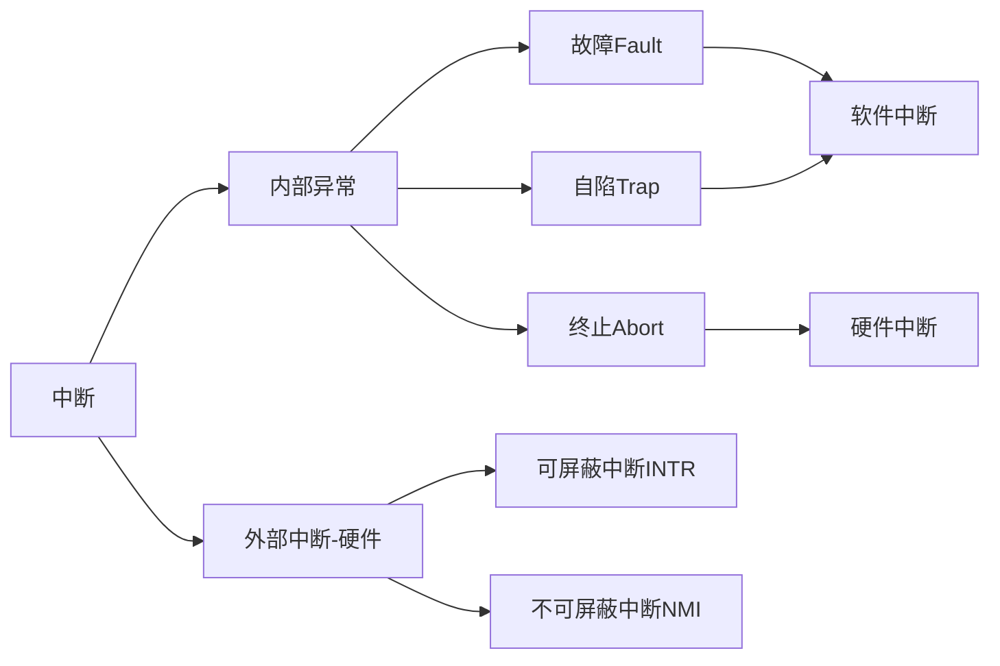
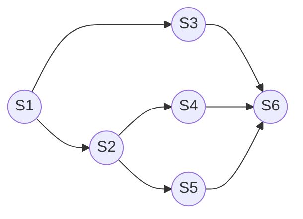
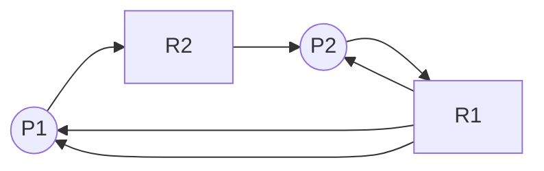

# 第1章 计算机系统概述

> ### 考纲内容
>
> 1. 操作系统的基本概念
>
> 2. 操作系统的发展历程
>
> 3. 程序运行环境
>
>    CPU运行模式：内核模式和用户模式
>
>    中断和异常的处理；系统调用
>
>    程序的链接与装入；程序运行时内存映像与地址空间
>
> 4. 操作系统结构：分层、模块化、宏内核、微内核、外核
>
> 5. 操作系统引导
>
> 6. 虚拟机
>
> ### 复习提示
>
> 本章通常以选择题的形式考查，重点考查操作系统的功能、运行环境和提供的服务

## 1.1 操作系统的基本概念

### 1.1.1 操作系统的概念

硬件提供基本的计算资源；应用程序规定按何种方式使用这些资源来解决用户的计算问题；操作系统控制和协调各用户的应用程序对硬件的分配和使用。

> 操作系统（Operating System，OS）是指控制和管理整个计算机系统的硬件和软件资源，合理地组织、调度计算机的工作与资源的分配，进而为用户和其它软件提供方便接口与环境的**`程序集合`**。
>
> 操作系统是计算机系统中**`最基本的系统软件`**。

### 1.1.2 操作系统的特征

#### 1. 并发 Concurrence

并发是指两个或多个事件在<font style="color: mediumaquamarine">同一时间间隔内</font>发生。操作系统的并发性指的是计算机系统中同时存在多个运行的程序，它是通过分时来实现的。

> <font style="color: mediumaquamarine; font-weight: bold">并行性</font>指的是系统具有同时进行运算或操作的特性，在<font style="color: mediumaquamarine">同一时刻</font>能完成两种或两种以上的工作。

#### 2. 共享 Sharing

指系统中的资源可供内存中多个并发执行的进程同时使用，它分为一下两种资源共享方式：

- 互斥共享方式
- 同时访问方式

> 在一段时间内只允许一个进程访问的资源称为<font style="color: #409EFF; font-weight: bold">临界资源</font>或<font style="color: #409EFF; font-weight: bold">独占资源</font>。

<font style="font-weight: bold; color: red; font-size: 20px">并发</font>和<font style="font-weight: bold; color: red; font-size: 20px">共享</font>是OS两个最基本的特征，两者之间互为存在条件：

① 资源共享是以程序并发为条件的；如果系统不允许程序并发执行，则自然不存在资源共享问题。

② 如果系统不能对资源共享实施有效的管理，则必将影响到程序的并发执行，甚至根本无法并发执行。

#### 3. 虚拟 Virtual

操作系统利用了多种虚拟技术来实现虚拟处理器、虚拟内存和虚拟外部设备等。操作系统的虚拟技术可归纳为：<font style="color: mediumaquamarine">时分复用技术</font>和<font style="color: mediumaquamarine">空分复用技术</font>。

#### 3. 异步 Asynchronism

多道程序环境允许多个程序并发执行，而由于资源有限，使得进程的执行并不是一贯到底的，它以不可预知的速度前行，这就是进程的异步性。

异步性使得OS运行在一种随机的环境下，可能导致进程产生和时间相关的错误。但是，只要运行环境相同，OS就必须保证多次运行进程后都能获得相同结果。

### 1.1.3 操作系统的目标和功能

#### 1. 操作系统作为计算机系统资源的管理者

- <font style="color: mediumaquamarine; font-weight: bold">进程管理</font>：进程控制、进程同步、进程通信、死锁处理、处理机调度等
- <font style="color: mediumaquamarine; font-weight: bold">存储器管理</font>：内存分配与回收、地址映射、内存保护与共享和内存扩充等功能
- <font style="color: mediumaquamarine; font-weight: bold">文件管理</font>：文件存储空间的管理、目录管理及文件读写管理和保护等
- <font style="color: mediumaquamarine; font-weight: bold">设备管理</font>：缓冲管理、设备分配、设备处理和虚拟设备等功能

#### 2. 操作系统作为用户与计算机硬件系统之间的接口

OS为用户提供的接口主要分为两类：一类是命令接口，用户利用这些操作命令来组织和控制作业的执行；另一类是程序接口，编程人员可以使用它们来请求操作系统服务。

##### a> <font style="color: mediumaquamarine; font-weight: bold">命令接口</font>

使用命令接口进行作业控制的主要方式有两种：即联机控制方式和脱机控制方式。

联机命令接口又称为交互式命令接口，“说一句，做一句”，这就强调了交互性。

脱机命令接口又称为批处理命令接口，“说一堆，做一堆”。

##### b> <font style="color: mediumaquamarine; font-weight: bold">程序接口</font>

程序接口由一组系统调用（也称广义指令）组成。

#### 3. 操作系统作为扩充机器

## 1.2 操作系统的发展与分类

### 1.2.1 手工操作阶段（无OS）

① <font style="color: #409EFF; ">用户独占全机，资源利用率低</font>

② <font style="color: #409EFF; ">CPU等待手工操作，利用不充分</font>

### 1.2.2 批处理阶段（OS开始出现）

#### 1. 单道批处理系统

主要特征：

- <font style="color: #409EFF; font-weight: bold">自动性</font>
- <font style="color: #409EFF; font-weight: bold">顺序性</font>
- <font style="color: #409EFF; font-weight: bold">单道性</font>

<font style="color: #409EFF; ">高速的CPU经常处于等待低速的I/O完成的状态</font>

#### 2. 多道批处理系统

特点：

- <font style="color: #409EFF; font-weight: bold">多道</font>
- <font style="color: #409EFF; font-weight: bold">宏观上并行</font>
- <font style="color: #409EFF; font-weight: bold">微观上串行</font>

它的实现需要解决一下问题：

1. 如何分配处理器
2. 多道程序的内存分配问题
3. I/O设备如何分配
4. 如何组织和存放大量的程序和数据，以方便用户使用和保证其安全性与一致性

<font style="color: mediumaquamarine; font-weight: bold">优点</font>：资源利用率高、系统吞吐量大

<font style="color: mediumaquamarine; font-weight: bold">缺点</font>：用户响应的时间较长；不提供人机交互能力，用户既不能了解自己的程序的运行情况，又不能控制计算机

### 1.2.3 分时操作系统

主要特征：

- <font style="color: #409EFF; font-weight: bold">同时性</font>：允许多个终端用户同时使用一台计算机
- <font style="color: #409EFF; font-weight: bold">交互性</font>
- <font style="color: #409EFF; font-weight: bold">独立性</font>：多个用户彼此独立地进行操作
- <font style="color: #409EFF; font-weight: bold">及时性</font>：用户在短时间内就能得到响应

分时系统很好的解决了人机交互的问题，但在一些实时应用场景中表现一般。

### 1.2.4 实时操作系统

实时操作系统的主要特点是<font style="color: #409EFF; font-weight: bold">及时性</font>和<font style="color: #409EFF; font-weight: bold">可靠性</font>

### 1.2.5 网络操作系统和分布式操作系统

### 1.2.6 个人计算机操作系统

## 1.3 操作系统的运行环境

### 1.3.1 操作系统的运行机制

CPU的状态划分为<font style="color: #409EFF; ">用户态</font>（目态）和<font style="color: #409EFF; ">核心态</font>（管态、内核态）；用户自编的程序运行在用户态，操作系统内核程序运行在核心态。大多数操作系统的内核包括以下四个方面的内容：

#### 1. 时钟管理

#### 2. 中断机制

中断机制中，只有一小部分功能属于内核，它们负责保护和恢复中断现场的信息，转移控制权到相关的处理程序。

#### 3. 原语

- 处于操作系统最底层，是最接近硬件的部分
- 这些程序的运行具有原子性，其操作只能一气呵成
- 这些程序的运行时间都比较短，而且调用频繁

#### 4. 系统控制的数据结构及处理

### 1.3.2 中断和异常的概念

为了实现可以在用户态和核心态两种工作状态之间切换，引入了中断和异常。当发生中断或异常时，运行用户态的CPU会立即进入核心态（通过硬件实现的）。

#### 1. 中断和异常的定义

中断也称外中断，是指来自CPU执行指令外部的事件。异常也称内中断，是指来自CPU执行指令内部的事件

#### 2. 中断和异常的分类



#### 3. 中断和异常的处理过程

### 1.3.3 系统调用

按功能分：

- 设备管理
- 文件管理
- 进程控制
- 进程通信
- 内存管理

## 1.4  系统结构

### 1. 分层法

分层法优点：

- 便于系统的调试和验证，简化了系统的设计和实现
- 易扩充和维护

问题：

- 合理定义各层比较困难，因为依赖关系固定后，往往就显得不够灵活
- 效率较差，操作系统每执行一个功能，通常要自上往下穿越多层

### 2. 模块化

按功能划分为若干具有一定独立性的模块，每个模块具有某方面的管理功能，并规定好各模块间的接口，使各模块之间能够通过接口进行通信。

衡量模块的独立性主要两个标准：内聚性和耦合度

模块化优点：

- 提高了操作系统设计的正确性、可理解性和可维护性
- 增强了操作系统的可适应性
- 加速了操作系统的开发过程

缺点：

- 模块间的接口规定很难满足对接口的实际需求
- 各模块设计者齐头并进，每个决定无法建立在上一个已验证的正确决定的基础上，因此无法找到一个可靠的决定顺序

### 3. 宏内核

将系统的主要功能模块都作为一个紧密联系的整体运行在核心态，从而为用户程序提供高性能的系统服务。因为各管理模块直接共享信息，能有效利用相互之间的有效特性，所以具有无可比拟的性能优势

### 4. 微内核

将内核中最基本的功能保留在内核，而将那些不需要在核心态执行的功能移动到用户态执行，从而降低内核的实际复杂性。那些移出内核的操作系统代码根据分层的原则被划分成若干服务程序，它们的执行相互独立，交互则都借助于微内核进行通信。

#### a> 微内核的基本功能

- 进程管理
- 低级存储器管理
- 中断和陷入处理

#### b> 微内核的特点

- 扩展性和灵活性
- 可靠性和安全性
- 可移植性
- 分布式计算

主要问题是性能问题

### 5. 外核

## 1.5 操作系统引导

常见操作系统引导过程如下：

1. 激活CPU
2. 硬件自检
3. 加载带有操作系统的硬盘
4. 加载主引导记录MBR
5. 扫描硬盘分区表
6. 加载分区引导记录PBR
7. 加载启动管理器
8. 加载操作系统

## 1.6 虚拟机

> #### 本章疑难点：
>
> 1. 并行性和并发性的区别与联系
> 2. 特权指令和非特权指令
> 3. 访管指令和访管中断
> 4. 定义微内核结构OS的四个方面

# 第2章 进程管理

> ### 考纲内容：
>
> - 进程与线程
>   - 进程与线程的基本概念；进程/线程的状态与切换
>   - 线程的实现：内核支持的线程，线程库支持的线程
>   - 进程与线程的组织与控制
>   - 进程间的通信：共享内存，消息传递，管道
> - CPU调度与上下文切换
>   - 调度的基本概念；调度的目标
>   - 调度的实现：调度器/调度程序（scheduler），调度的时机与调度方式（抢占式/非抢占式），闲逛进程，内核级线程与用户级线程调度
>   - 典型调度算法：先来先服务、短作业优先、时间片轮转、优先级、高响应比、多级队列、多级反馈队列
>   - 上下文及其切换机制
> - 同步与互斥
>   - 同步与互斥的基本概念
>   - 基本的实现方法：软件方法；硬件方法
>   - 锁；信号量；条件变量
>   - 经典同步问题：生产者-消费者问题，读者-写者问题；哲学家进餐问题
> - 死锁
>   - 死锁的基本概念；死锁预防
>   - 死锁避免；死锁检测和解除

## 2.1 进程与线程

### 2.1.1 进程的概念和特征

#### 1. 进程的概念

为了更好的描述和控制程序的并发执行，引入了进程的概念，从而实现了操作系统的并发性和共享性。

为了使参与并发执行的程序能够独立的运行，系统利用一个专门的数据结构——进程控制块（Process Control Block,PCB）来描述进程的基本情况和运行状态，进而控制和管理进程。

进程映像（进程实体）由三部分组成：

- 程序段
- 相关数据段
- PCB

所谓创建进程，其实就是创建进程映像中的PCB，同理，撤销进程则是撤销进程的PCB。

> 进程映像是静态的，进程是动态的
>
> **PCB是进程存在的唯一标志！**

*进程是进程实体的运行过程，是系统进行资源分配和调度的一个基本单位*

#### 2. 进程的特征

##### a> 动态性——最基本特征

##### b> 并发性——引入进程的目的

##### c> 独立性——基本单位，凡是未建立PCB的程序，都不能作为一个独立单位参与运行

##### d> 异步性——导致结果的不可在现性，从而出现进程同步机制

##### e> 结构性——进程实体由三部分组成

### 2.1.2 进程的状态与切换

三种基本状态：运行态、就绪态、阻塞态，以及创建态和结束态。

就绪态是指除了处理机资源，其他资源都已经到位了，而等待态则表示着还需要其他资源（除了处理机）或等待某一事件。

一个进程从运行态到阻塞态是主动的行为；但是从阻塞态变成就绪态是被动的行为，需要其他进程协助。

### 2.1.3 进程控制

#### 1. 进程的创建

进程创建原语：

- 分配唯一进程标识号，申请一个空白PCB（申请失败，则创建失败）
- 为进程分配资源（资源不足，处于阻塞态）
- 初始化PCB（主要包括标识信息、处理机状态、处理机控制信息，以及设置进程的优先级等）
- 就绪队列有空闲，则将其插入就绪队列，等待被调度

#### 2. 进程的终止

进程撤销原语：

- 根据被终止进程的标识符，检索PCB，从中读出该进程的状态
- 若其处于执行状态，立即终止，将处理机资源分配给其他进程
- 若有子孙进程，应将其也全部终止
- 将其拥有的所有资源，归还给父进程或者OS
- 将该PCB从所在队列中删除

#### 3. 进程的阻塞和唤醒

进程阻塞原语：

- 根据标识号找到对应的PCB
- 若处于运行态，保护现场，转为阻塞态，并停止运行
- 把该PCB插入等待队列，将处理机资源调度给其他就绪进程

唤醒原语：

- 从等待队列中找到对应PCB
- 将其从等待队列移出，置为就绪态
- 把该PCB插入就绪队列，等待调度程序调度

#### 4. 进程切换

指的是：处理机从一个进程的运行转到另一个进程上运行，过程如下：

- 保存处理机上下文，包括程序计数器和其他寄存器

- 更新PCB信息
- 把进程的PCB移入相应队列
- 选择另一个进程执行，并更新其PCB
- 更新内存管理的数据结构
- 恢复处理机上下文

> **调度**和**切换**：调度是一种决策行为，为切换是实际分配的行为，是执行行为。一般先有资源的调度，然后才有进程的切换。

### 2.1.4 进程的组织

#### 1. 进程控制块

| 进程描述信息      | 进程控制和管理信息 | 资源分配清单 | 处理机相关信息 |
| ----------------- | ------------------ | ------------ | -------------- |
| 进程标识符（PID） | 进程当前状态       | 代码段指针   | 通用寄存器值   |
| 用户标识符（UID） | 进程优先级         | 数据段指针   | 地址寄存器值   |
|                   | 代码运行入口地址   | 堆栈段指针   | 控制寄存器值   |
|                   | 程序的外存地址     | 文件描述符   | 标志寄存器值   |
|                   | 进入内存时间       | 键盘         | 状态字         |
|                   | 处理机占用时间     | 鼠标         |                |
|                   | 信号量使用         |              |                |

> 常用的PCB组织方式有链接和索引两种

#### 2. 程序段

执行的程序代码段，程序可被多个进程共享，即多个进程可以运行同一个程序

#### 3. 数据段

原始数据，执行过程的中间或最终结果

### 2.1.5 进程的通信

#### 1. 共享存储

#### 2. 消息传递

#### 3. 管道通信

### 2.1.6 线程概念和多线程模型

#### 1. 线程的基本概念

引入线程的目的是减小程序在并发执行时所付出的时空开销，提高操作系统的并发性能。线程是进程中的一个实体，自己不拥有系统资源，是被系统独立调度和分派的基本单位。

在引入线程后，进程只作为除CPU外的系统资源的分配单元，而线程则作为处理机的分配单元。

#### 2. 线程与进程的比较

##### a> 调度

在引入线程之前，拥有资源和独立调度的基本单位都是进程；之后，线程是独立调度的基本单位，进程则是拥有资源的基本单位。

##### b> 拥有资源

线程不拥有系统资源（也有一些必不可少的资源），但是它可以访问其隶属进程的系统资源

##### c> 并发性

都可以

##### d> 系统开销

线程小

##### e> 地址空间和其他资源

进程的地址空间之间相互独立，同一进程的各线程间共享进程的资源，某进程内的线程对于其他进程不可见

##### f> 通信方面

进程间通信（IPC）需要进程同步和互斥手段的辅助，而线程间可以直接读/写进程数据段来进行通信

#### 3. 线程的属性

- 线程是一个轻型实体，不拥有系统资源，但每个线程都应有一个唯一标识符和一个线程控制块（记录了线程执行的寄存器和栈等现场状态）
- 不同线程可以执行相同程序
- 同一进程中的各个线程共享该进程拥有的资源
- 线程是处理机的独立调度单位，多个线程可以并发执行
- 一个线程被创建后，便开始了它的生命周期，直至终止

#### 4. 线程的实现方式

##### a> 用户级线程（User-Level Thread, ULT）

##### b> 内核级线程（Kernel-Level Thread,KLT）

#### 5. 多线程模型

实现用户级线程和内核级线程的连接方式：

##### a> 多对一模型

优点：线程管理在用户空间进行，效率较高

缺点：一个线程在使用内核服务时被阻塞，整个进程被阻塞

##### b> 一对一模型

优点：并发能力强

缺点：创建线程开销较大

##### c> 多对多模型

集两者之所长

## 2.2 处理机调度

### 2.2.1 调度的概念

#### 1. 调度的基本概念

从就绪队列中按照一定的算法选择一个进程并将处理机分配给它运行

#### 2. 调度的层次

##### a> 作业调度

又称高级调度。内存与辅存之间的调度，一个作业只调入一次，调出一次

##### b> 中级调度

又称内存调度。将不能运行的进程调至外存等待；当具备运行条件且内存有空闲重新调入内存

##### c> 进程调度

又称低级调度。按照一定策略，选取一个进程将处理机分配给它

#### 3. 三级调度的联系

作业调度从外存的后备队列选择一批作业进入内存，为它们建立进程，这些进程被送入就绪队列，进程调度就从中选出一个进程运行。中级调度将暂时不能运行的进程挂起，在合适时再将其唤醒。

### 2.2.2 调度的时机、切换与过程

不能进行进程的调度与切换的情况：

- 处理中断的过程
- 进程在操作系统内核程序临界区中
- 其他需需要完全屏蔽中断的原子操作过程中

应该进行的情况：

1. 发生引起调度条件且当前进程无法继续运行下去时
2. 中断处理结束或自陷处理结束后

### 2.2.3 进程调度方式

#### a> 非剥夺调度方式

#### b> 剥夺调度方式

### 2.2.4 调度的基本准则

#### a> CPU利用率

#### b>系统吞吐量

#### c> 周转时间

指从作业提交到作业完成所经历的时间，是作业等待、在就绪队列中排队、在处理机上运行以及进行输入/输出操作所花费时间的总和。
$$
周转时间 = 作业完成时间 - 作业提交时间
$$

$$
带权周转时间 = \frac{作业周转时间} {作业实际运行时间}
$$

#### d> 等待时间

指进程处于等处理机状态的时间之和

#### e> 响应时间

### 2.2.5 典型的调度算法

#### 1. 先来先服务（FCFS）

算法简单，但效率低；对长作业有利，但对短作业不利（相对而言）；有利于CPU繁忙型作业，而不利于I/O繁忙型作业

#### 2. 短作业优先（SJF）

平均等待时间、平均周转时间最少

对长作业不利，可能出现饥饿；紧急作业不能保证及时处理；作业时间长短无法程序预估，靠人为不一定能做到SJF

#### 3. 优先级

一般而言：

- 系统进程 > 用户进程
- 交互型进程  > 非交互型（前台 > 后台）
- I/O型 >  计算型

#### 4. 高响应比优先

$$
响应比 = \frac {等待时间 + 要求服务时间} {要求服务时间}
$$

#### 5. 时间片轮转

时间片大小应适当

#### 6. 多级队列

#### 7. 多级反馈队列

## 2.3 进程同步

### 2.3.1 进程同步的基本概念

#### 1. 临界资源

一次性仅允许一个进程使用的资源。访问临界资源的那段代码称为临界区。为了保证临界资源的正确使用，可把临界资源的访问过程分为四个部分：

- 进入区；检查是否可进入临界区，能则设置正在访问临界区的标志
- 临界区
- 退出区；将正在访问临界区的标志清楚
- 剩余区；代码中的其余部分

#### 2. 同步

直接制约关系

#### 3. 互斥

间接制约关系

为禁止两个进程同时进入临界区，同步机制应遵循一下原则：

- 空闲让进
- 忙则等待
- 有限等待
- 让权等待；进程不能进入临界区，立即释放处理器，防止进程忙等待

### 2.3.2 实现临界区互斥的基本方法

#### 1. 软件实现方法

##### a> 单标志法

两进程必须交替进入临界区，会产生违背“空闲让进”原则的现象

##### b> 双标志法先检查

访问之前，查看临界区是否正在被访问。可能同时进入临界区，产生违背“忙则等待”原则的现象

##### c> 双标志法后检查

先检查是先检查对方，在设置自己。后检查则是先将自己设置为在访问临界区，再检查对方是否在访问

##### d> Peterson's Algorithm

在设置完自己后，再设置一个turn标志，防止发生同时进入的现象，解决“饥饿”现象

#### 2. 硬件实现方法

##### a> 中断屏蔽方法

限制了处理机交替执行程序的能力

##### b> 硬件指令方法

TestAndSet指令：这条指令是原子操作，即执行该代码时不允许被中断。功能是读出指定标志后把该标志设置为真

Swap指令：交换两个字的内容

硬件方法的优点：适用于任意数目的进程，而不管是单处理机还是多处理机；简单、容易验证其正确性。可以支持进程内有多个临界区，只需为每个临界区设立一个布尔变量

硬件方法的缺点：进程等待进入临界区要耗费处理机时间，不能实现让权等待。从等待进程中随即选择一个进入临界区，有的可能一直选不上，从而导致“饥饿”

### 2.3.3 信号量

只能被两个标准的原语wait（S）和signal（S）访问，PV操作。

#### 1. 整型信号量

一个用于表示资源数目的整型量S ，wait和signal操作可描述为：

```
wait(S) {
	while (S <= 0) ;
	S = S - 1;
}
signal(S) {
	S = S + 1;
}
```

wait操作中，只要信号量S <= 0,就会不断测试。因此，该机制并未遵循“让权等待”的准则，而是使进程处于“忙等”状态

#### 2. 记录型信号量

不存在忙等。除了一个用于表示资源数目的整型，再增加一个进程链表L,用于链接所有等待该资源的进程。记录型信号量可描述为：

```c
typedef struct {
    int value;
    struct process *L;
} semaphore;
```

相应的wait和signal操作：

```c
void wait(semaphore S) { // 相当于申请资源
    S.value--; // 资源减少
    if (S.value < 0) { // 没有资源，等待，block自我阻塞，放弃处理机，从而实现让权等待
        add this process to S.L;
        block(S.L);
    }
}
```

```c
void signal(semaphore S) { // 相当于释放资源
    S.value++;
    if (S.value <= 0) {
        remove a process P from S.L;
        wakeup(P);
    }
}
```

#### 3. 利用信号量实现同步

```c
// S为实现P1、P2同步的公共信号量，y要使用x,所以x要先执行
semaphore S = 0;
P1() {
    x; // x执行
    V(S); // 执行完后，告诉P2
    ...
}
P2() {
    ...
    P(S); // 检查x是否执行
    y; // 确认执行完成，运行y
    ...
}
```

#### 4. 利用信号量实现进程互斥

```c
// 初始时可用资源为1
semaphore S = 1;
P1() {
    ...
    P(S); // 加锁
    进程P1的临界区;
    V(S); // 解锁
    ...
}
P2() {
    ...
    P(S);
    进程P2的临界区;
    V(S);
    ...
}
```

> PV操作在同步互斥中的应用：在同步问题中，若某个行为要用到某种资源，则在这个行为前面P这种资源一下，若某个行为会提供某种资源，则在这个行为后面V这种资源一下。前P后V

#### 5. 利用信号量实现前驱关系



```c
semaphore a12 = a13 = a24 = a25 = a36 = a46 = a56 = 0;
S1() {
    ...;
    V(a12); V(a13);
}
S2() {
    P(a12);
    ...;
    V(a24); V(a25);
}
S3() {
    P(a13);
    ...;
    V(a36);
}
S4() {
    P(a24);
    ...;
    V(a46);
}
S5() {
    P(a25);
    ...;
    V(a56);
}
S6() {
    P(a36); P(a46); P(a56);
    ...;
}
```

#### 6. 分析进程同步和互斥问题的方法步骤

1. 关系分析
2. 整理思路
3. 设置信号量

### 2.3.4 管程

管程的特性保证了进程互斥，无须程序员自己实现互斥，从而降低发生死锁的可能性。同时管程提供了 条件变量，可以让程序员灵活的实现进程同步。

#### 1. 管程的定义

管程由四个部分组成：

1. 管程的名称
2. 局部于管程内部的共享数据结构说明
3. 对该数据结构进行操作的一组过程（或函数）
4. 对局部于管程内部的共享数据设置初始值的语句

管程很像一个类：

- 管程把对共享资源的操作封装起来
- 每次仅允许一个进程进入管程，从而实现进程互斥。

#### 2. 条件变量

当一个进程进入管程后被阻塞，直到阻塞原因被解除。在此期间，如果进程不释放管程，其他进程无法进入管程。为此，将阻塞原因定义为条件变量condition。通常，一个进程被阻塞的原因可以有多个，因此管程中设置了多个条件变量。每个条件变量保存了一个等待队列，用于记录因该条件变量而阻塞的所有进程，对条件变量只能进行两种操作，PV

> x.wait：当x对应的条件不满足时，正在调用管程的进程调用x.wait将自己插入x条件的等待队列，并释放管程。
>
> x.signal：x对应的条件发生了变化，则调用x.signal,唤醒一个因x条件而阻塞的进程

```c
monitor Demo {
    共享数据结构S;
    conditon x; // 定义一个条件变量x
    init_code() {...}
    take_away() {
        if (S <= 0) x.wait(); // 资源不够，在条件变量x上阻塞等待
        资源足够，分配资源，做一系列相应处理
    }
    give_back() {
        归还资源，做一系列相应处理
        if (有进程在等待) x.signal() // 唤醒一个阻塞进程
    }
}
```

> 条件变量和信号量的比较：
>
> - 相似点：类似于信号量P/V操作，可以实现进程的阻塞/唤醒
> - 不同点：条件变量是没有值的，仅实现了排队等待的功能；而信号量是有值的，信号量的值反映了剩余资源数，而在管程中，剩余资源数用共享数据结构记录

### 2.3.5 经典同步问题

#### 1. 生产者-消费者问题

```c
semaphore mutex = 1; // 互斥信号量
semaphore empty = n; // 空闲缓冲区
semaphore full = 0; // 缓冲区初始化为空
producer() {	// 生产者生产缓冲区，full++，empty--
    while (1) {	// 生产者一直生产
        produce an item in nextp; // 生产出一个缓冲区，要使用一个空闲缓冲区
        P(empty);	// 检查是否有空闲的缓冲区
        P(mutex);	// 检查消费者是否在消费
        add nextp to buffer;	// 将缓冲区放入
        V(mutex);	// 释放互斥信号量
        V(full);	// 缓冲区 + 1
    }
}
consumer() {	// 消费者消费缓冲区，empty++，full--
    while (1) {
        P(full);
        P(mutex);
        remove an item from buffer;
        V(mutex);
        V(empty);
        consume the item
    }
}
```

#### 2. 读者-写者问题

```c
int count = 0;	// 读者数量
semaphore mutex = 1;	// 读者互斥修改count
semaphore rw = 1;	// 读写者互斥访问文件
writer() {
    while (1) {
        P(rw);
        writing;
        V(rw);
    }
}
reader() {
    while (1) {
        P(mutex);
        if (count == 0) P(rw);
        count++;
        V(mutex);
        reading;
        P(mutex);
        count--;
        if (count == 0) V(rw);
        V(mutex);
    }
}
```


#### 3. 哲学家进餐问题


#### 4. 吸烟者问题


## 2.4 死锁

### 2.4.1 死锁的概念

#### 1. 死锁的定义

多个进程因竞争资源而造成的一种僵局（互相等待），若无外力作用，这些进程都将无法向前推进

#### 2. 死锁产生的原因

##### a> 系统资源的竞争

##### b> 进程推进顺序非法

#### 3. 死锁产生的必要条件

##### a> 互斥条件

##### b> 不剥夺条件

##### c> 请求并保持条件

##### d> 循环等待条件

#### 4. 死锁的处理策略

|          | 资源分配策略                                   | 各种可能模式                             | 主要优点                                 | 主要缺点                                                     |
| -------- | ---------------------------------------------- | ---------------------------------------- | ---------------------------------------- | ------------------------------------------------------------ |
| 死锁预防 | 保守，宁可资源闲置                             | 一次请求所有资源，资源剥夺，资源按序分配 | 适用于突发式处理的进程，不必进行剥夺     | 效率低，进程初始化时间延长，剥夺次数过多，不便灵活申请新资源 |
| 死锁避免 | 是预防和检测的折中（在运行中判断是否可能死锁） | 寻找可能的安全运行顺序                   | 不必进行剥夺                             | 必须知道将来的资源需求，进程不能被长时间阻塞                 |
| 死锁检测 | 宽松，只要允许就分配资源                       | 定期检查死锁是否已经发生                 | 不延长初始化时间，允许对死锁进行现场处理 | 通过剥夺解除死锁，造成损失                                   |

### 2.4.2 死锁预防

破坏死锁产生的4个必要条件之一即可

### 2.4.3 死锁避免

事先预防策略，但并不是说事先采取某种限制措施破坏死锁的必要条件，而是在资源动态分配过程中，防止系统进入不安全状态，以避免发生死锁

#### 1. 系统安全状态

并非所有的不安全状态都是死锁状态，但当系统进入不安全状态后，便可能进入死锁状态；反之，只要系统处于安全状态，系统便可避免进入死锁状态

#### 2. 银行家算法

### 2.4.4 死锁检测和解除

#### 1. 资源分配图



#### 2. 死锁定理

S为死锁的条件是当且仅当S状态的资源分配图是不可完全简化的，该条件为死锁定理

#### 3. 死锁解除

- 资源剥夺法
- 撤销进程法
- 进程回退法

> #### 本章疑难点：
>
> 1. 进程与程序的区别与联系
> 2. 死锁与饥饿
> 3. 银行家算法的工作原理
> 4. 进程同步、互斥的区别与联系